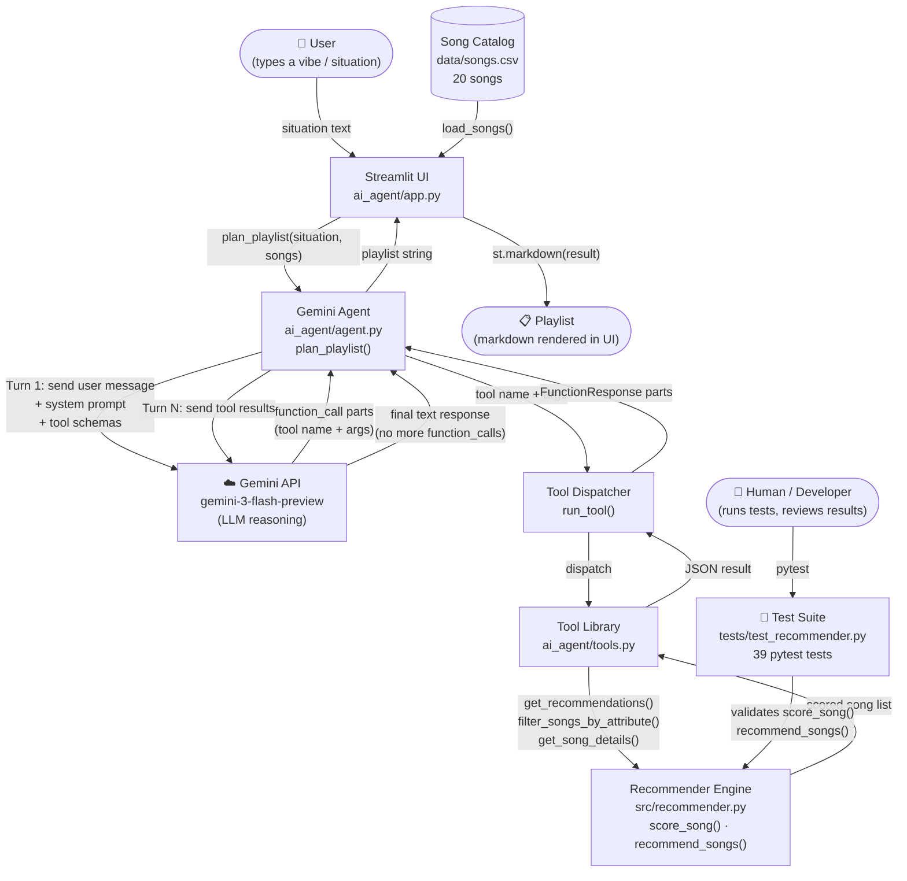
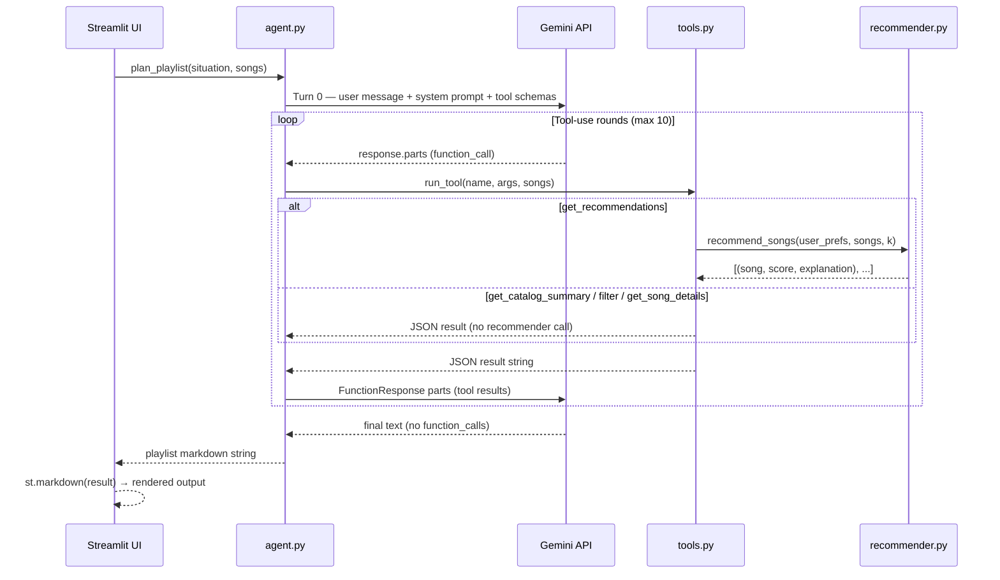

# System Architecture — AI Playlist Planner

## Component Overview

| Component | File | Role |
|---|---|---|
| Streamlit UI | `ai_agent/app.py` | User-facing web interface; loads catalog; renders output |
| Gemini Agent | `ai_agent/agent.py` | Manages agentic loop; sends/receives messages with Gemini API |
| Tool Dispatcher | `agent.py · run_tool()` | Routes Gemini's function_call requests to the right Python function |
| Tool Library | `ai_agent/tools.py` | 4 callable tools: catalog summary, recommendations, filter, song details |
| Recommender Engine | `src/recommender.py` | Core scoring logic: `score_song()`, `recommend_songs()` |
| Song Catalog | `data/songs.csv` | 20 songs with genre, mood, energy, acousticness, valence, tempo |
| Test Suite | `tests/test_recommender.py` | 39 pytest tests; human-verified correctness of recommender |

---

## Data Flow Diagram

---

## Agentic Loop Detail

---

## Where Humans Are Involved

| Touch point | How |
|---|---|
| **Input** | User types a natural-language situation in the Streamlit text box |
| **Output review** | User reads and judges the AI-generated playlist |
| **Test authoring** | Developer wrote 39 unit tests in `tests/test_recommender.py` |
| **Test execution** | Developer runs `pytest` to verify recommender correctness |
| **API key setup** | Developer sets `GEMINI_API_KEY` in `.env` before running |
